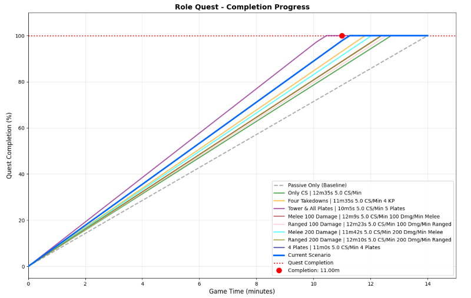
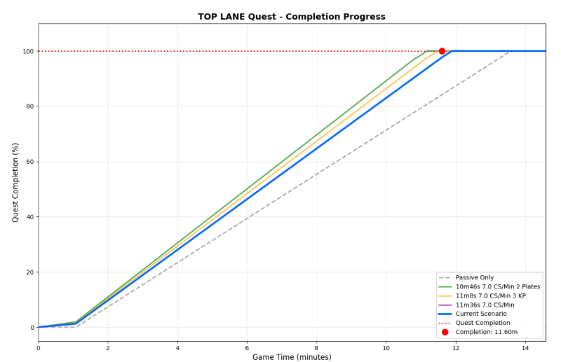
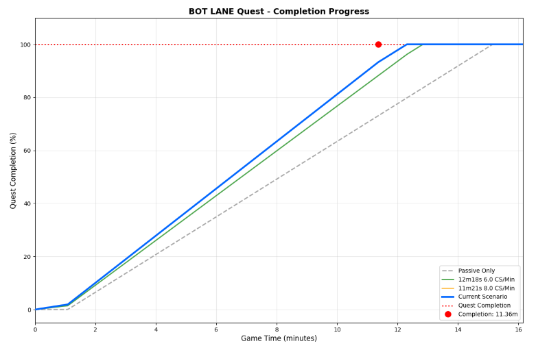
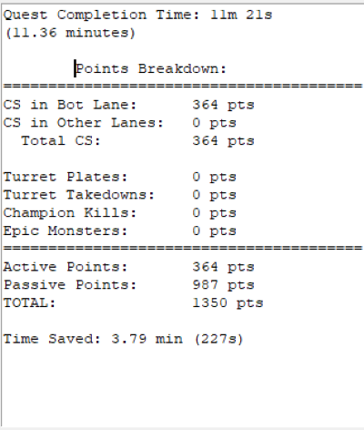
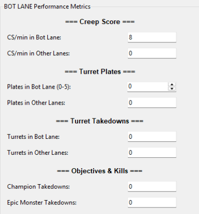

Ever wondered exactly when your role quest will finish based on your playstyle? I built a set of calculators that show you the exact completion time and visualize your progress throughout the game.

## What This Does
These calculators let you input your typical game stats (CS/min, kills, plates, objectives, etc.) and instantly see:
Exact quest completion time down to the second
Visual progression graph showing your quest completion % over time
Scenario comparisons - compare aggressive vs. farm-focused playstyles side-by-side
Detailed breakdown of how each metric contributes to faster completion
Perfect for planning your early game, understanding which objectives matter most for your role, or just satisfying your curiosity about quest mechanics.

## Screenshots









## Example Use Cases
- "If I average 7 CS/min and get first tower plus all 5 plates, when do I complete as a mid laner?"
10:37
- "How much faster is getting 3 kills vs. 2 extra plates as a top laner?"
3 kills = 28 seconds faster vs 2 plates = 50 seconds faster
- "How much faster would my quest finish if I improve my CS from 6 to 8 per minute as a bot laner?"
+2 CS/min = 57 seconds faster
- "How much does roaming hurt my quest completion time?"
   - Every 15 seconds out of lane = will require 12 additional seconds of in-lane time to compensate
   - 1 minute out of lane = ~48 additional seconds in-lane needed

## Features
- Lane-specific calculators for Top, Mid, and Bot with accurate point values
- Interactive graphs with zoom/pan controls and the ability to compare multiple scenarios
- Cross-platform - works on Windows, macOS, and Linux

## Game Mechanics Implemented
Based on official Season 2025 role quest data:

### All Lanes

- 96 Points/min passive generation starting at 1:05 (in lane only)
- 20 Points/min when out of lane
- 50 Points per turret destroyed in assigned lane, 25 in other lanes
- 40 Points per turret plate destroyed in assigned lane, 20 in other lanes
- 30 Points per epic monster (Dragon, Rift Herald, Baron)

### Top Lane

- 1200 points to complete
- 2 Points per CS in top lane, 1 point elsewhere
- 15 Points per takedown

### Bot Lane

- 1350 points to complete
- 3 Points per CS in bot lane, 1.5 points elsewhere
- 15 Points per takedown

### Mid Lane

- 1350 points to complete
- 2 Points per CS in mid lane, 1 point elsewhere
- 25 Points per takedown (higher than other lanes)
- Champion damage bonus: 3% (melee) or 1.5% (ranged) of damage dealt to champions

## ScreenShots


## Requirements

- **Python 3.8 or higher**
- **tkinter** (usually comes pre-installed with Python)
- **matplotlib** and **numpy** (installed via requirements.txt)

## Installation

1. **Ensure Python is installed:**
   ```bash
   python --version
   ```
   If not installed, download from [python.org](https://www.python.org/downloads/)

2. **Install required packages:**
   ```bash
   pip install -r requirements.txt
   ```
   
   If you encounter permission errors, try:
   ```bash
   pip install -r requirements.txt --user
   ```

3. **For Linux users:** If tkinter is not installed:
   ```bash
   # Ubuntu/Debian
   sudo apt-get install python3-tk
   
   # Fedora
   sudo dnf install python3-tkinter
   ```

## Quick Start

### Option 1: Use The Executable For The Desired Lane
1. Use the links below to download the pre-packaged Executables for your lane (File Downloads via GitHub Releases, 38 MB each):
   - Top Lane: [`LoL_Quest_Calculator_Top.exe`](https://github.com/Hailfire805/League-Of-Legends-Role-Quest-Completion-Calculator/releases/download/V1.0.1/LoL_Quest_Calculator_Top.exe)
   - Mid Lane: [`LoL_Quest_Calculator_Mid.exe`](https://github.com/Hailfire805/League-Of-Legends-Role-Quest-Completion-Calculator/releases/download/V1.0.1/LoL_Quest_Calculator_Mid.exe)
   - Bot Lane: [`LoL_Quest_Calculator_Bot.exe`](https://github.com/Hailfire805/League-Of-Legends-Role-Quest-Completion-Calculator/releases/download/V1.0.1/LoL_Quest_Calculator_Bot.exe)
2. Run the downloaded `.exe` file directly (no installation needed)
3. Input your typical game stats in the GUI and hit "Calculate" or "Add to Comparison" to view multiple scenarios

### Option 2: Double-Click Launcher
**Windows users:**
- Double-click `launch.bat`

**macOS/Linux users:**
- Double-click `launch.sh` (or run `./launch.sh` in terminal)

The launcher will automatically:
- Check if Python is installed
- Install required packages if needed
- Show you a menu to select your lane

### Option 3: Using the Python Launcher
1. Download all files to a folder
2. Install dependencies: `pip install -r requirements.txt`
3. Run the launcher:
   ```bash
   python launcher.py
   ```
4. Select your lane from the menu

### Option 4: Direct Launch (For advanced users)
1. Download all files to a folder
2. Install dependencies: `pip install -r requirements.txt`
3. Run your lane's calculator directly:
   ```bash
   python quest_timer_calculator_top.py    # For Top Lane
   python quest_timer_calculator_bot.py    # For Bot Lane
   python quest_timer_calculator.py        # For Mid Lane
   ```

> **Note for Distributors:** See `BUILD_EXE_GUIDE.md` for instructions on creating the standalone .exe version

## Available Calculators

| File | Lane | Quest Points Required |
|------|------|----------------------|
| `quest_timer_calculator_top.py` | Top Lane | 1200 points |
| `quest_timer_calculator_bot.py` | Bot Lane | 1350 points |
| `quest_timer_calculator.py` | Mid Lane | 1350 points |

## How to Use

1. **Enter your performance metrics** in the left panel:
   - CS per minute
   - Champion damage per minute (Mid Lane only)
   - Turret plates secured
   - Turrets destroyed
   - Champion takedowns (kills/assists)
   - Epic monster takedowns

2. **Click "Calculate Quest Time"** to see:
   - Estimated completion time
   - Points breakdown
   - Visual graph showing completion progress

3. **Add scenarios to compare:**
   - Click "Add to Comparison" to save the current scenario
   - Enter a custom label (or use the auto-generated one)
   - Compare multiple playstyles side-by-side on the graph

4. **Use zoom tools:**
   - Click the magnifying glass icon to zoom into specific time ranges
   - Use the home button to reset the view
   - Save graphs as images with the save button

### Comparison Feature
Click "Add to Comparison" to save the current scenario, then modify inputs and calculate again. The graph will overlay multiple scenarios for easy comparison.

### Custom Comparison Labels
When adding a scenario to comparison, you'll be prompted to enter a custom label. This allows you to name scenarios meaningfully (e.g., "Aggressive Early", "Farm Focus", "With First Blood") rather than using generic numbering.

### Graph Zoom and Pan
The matplotlib toolbar below the graph provides zoom and pan controls:
- **Zoom**: Click the magnifying glass icon, then drag on the graph to zoom into a region
- **Pan**: Click the crossed arrows icon, then drag to move around
- **Home**: Click the house icon to reset the view
- **Back/Forward**: Navigate through zoom history
- **Save**: Export the current graph as an image

## Notes

- The accumulation curves model the passive generation system (starts at 1:05)
- CS and damage contributions scale continuously with time based on your input rates
- Objective timing is simplified by distributing contributions linearly for visualization purposes
- All formulas are based on official League of Legends Season 2025 role quest data
- Each lane has different point requirements and CS multipliers reflecting unique quest mechanics

## Troubleshooting

**"ModuleNotFoundError: No module named 'tkinter'"**
- tkinter needs to be installed separately on some systems
- Linux: `sudo apt-get install python3-tk` (Ubuntu/Debian)
- The module should come pre-installed on Windows and macOS

**"ModuleNotFoundError: No module named 'matplotlib'"**
- Run: `pip install -r requirements.txt`
- If that fails, try: `pip install matplotlib numpy --user`

**Graph not displaying or window is blank**
- Make sure you're running Python 3.8 or higher
- Try updating matplotlib: `pip install --upgrade matplotlib`

**Performance issues or slow loading**
- This is normal on first launch as matplotlib initializes
- Subsequent calculations should be faster

## Credits

Calculators created for League of Legends Season 2025 role quest research and analysis.

Quest mechanics and point values sourced from the official League of Legends Wiki, which can be found here: League of Legends Role Quests

## License

These tools are provided for educational and analytical purposes. League of Legends and all related properties are trademarks of Riot Games, Inc.
